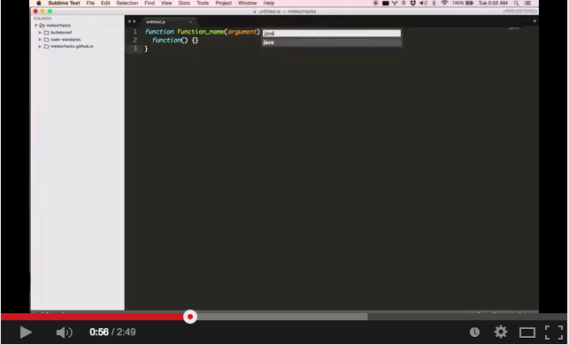

# Updaing Sublime Text Snippets

There is no way to automatically we need to at the moment. We've to do it automatically.

> It's better if we can have meteor and javascript packages altered for our format. So, PRs are welcome to this document with those packages.

## Via PackageResourceViewer

We'll be using a package called [`PackageResourceViewer`](https://github.com/skuroda/PackageResourceViewer) to alter current snippets we are using. This works with any package you've installed too.

Watch following video to learn how to use this package.

